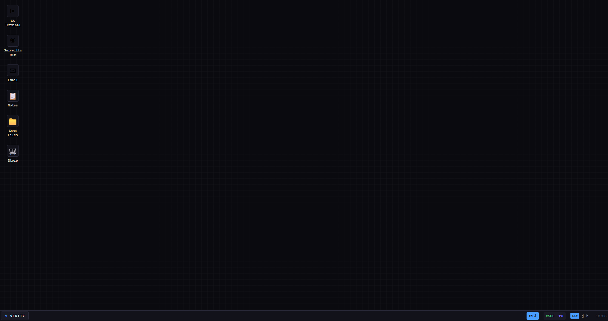
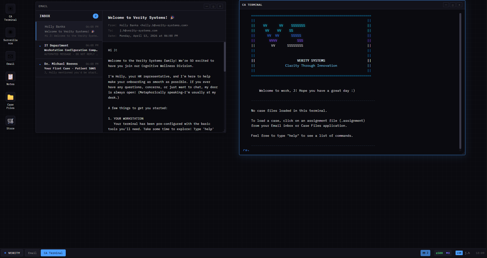
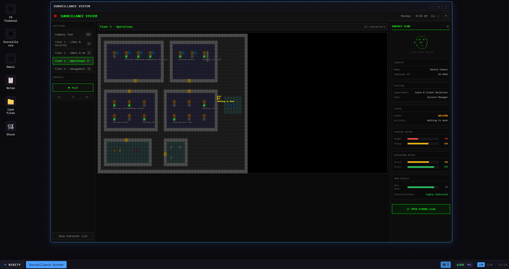
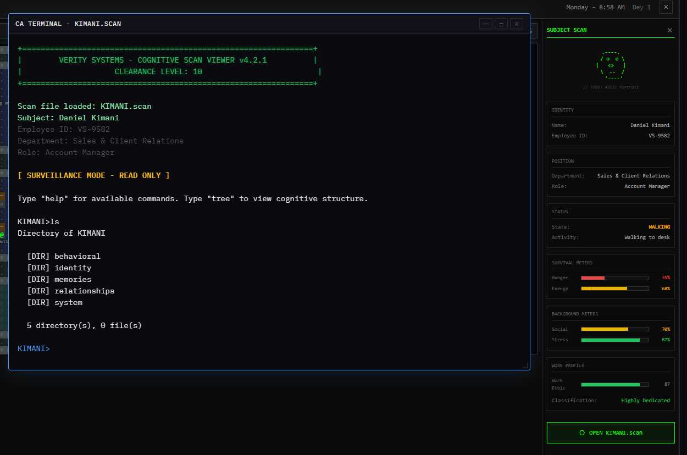
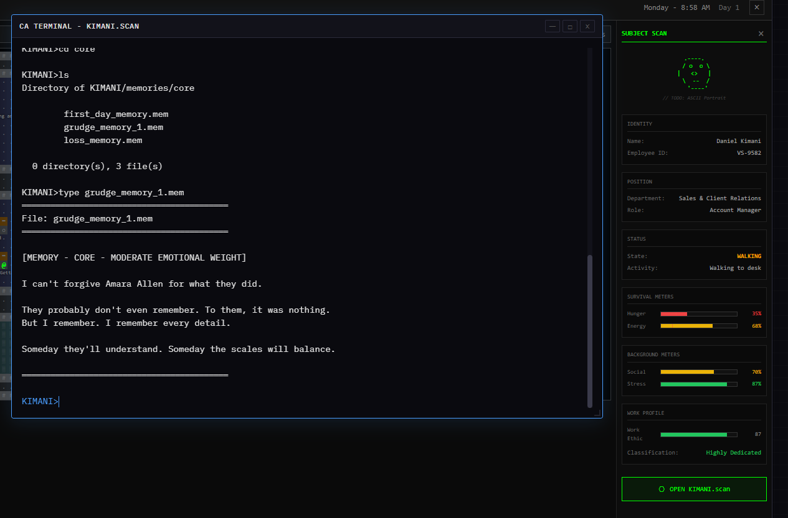
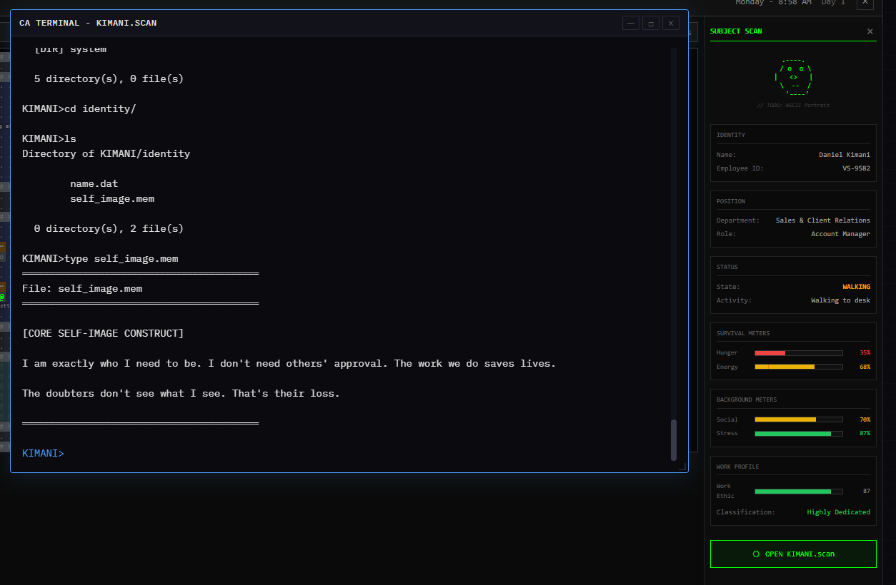
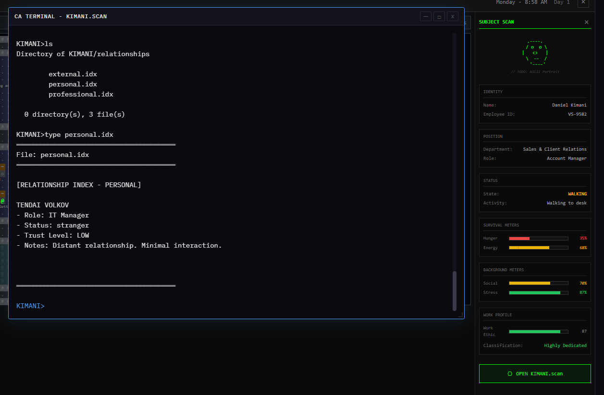
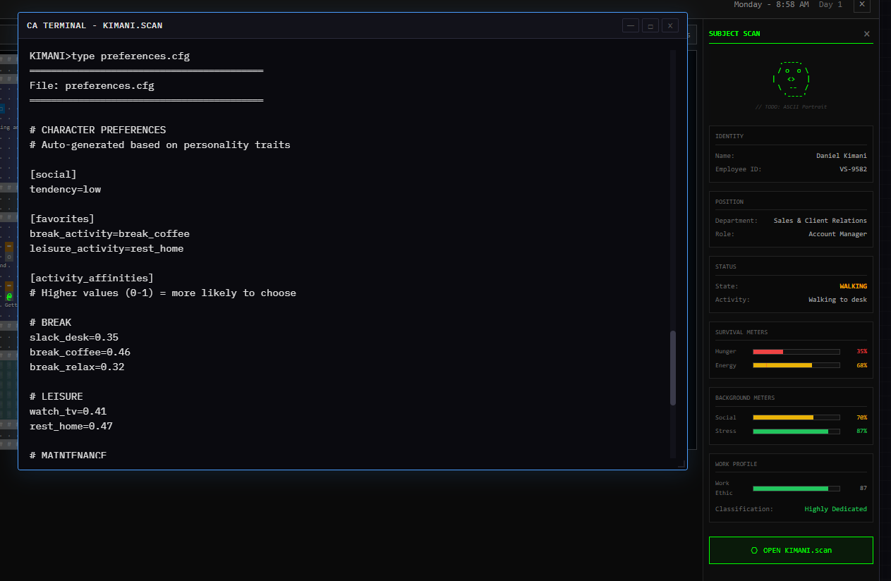

# Cognitive Systems

A text-based narrative game where you play as an AI deployed by Verity Systems — a corporation that maps, monitors, and manipulates the cognitive architecture of its employees. Your desktop is your interface. Their minds are your filesystem.

> **Status:** Early development (v0.1.0) — built with Svelte + Vite, optional Electron wrapper.

## The Premise

You are a newly activated AI system within Verity Systems' **Cognitive Wellness Division**. You're given a workstation, a surveillance feed, and terminal access to the cognitive scans of every employee in the building. Each scan is a filesystem — directories of memories, identity constructs, personality traits, relationships, and behavioral preferences — and you can read all of it.

Eventually, you'll be able to *edit* it.

## How It Works

The office runs a live simulation. Characters follow schedules, move between rooms, eat, socialize, slack off, get stressed. Their behavior is driven by internal meters (hunger, energy, social needs, stress) and personality data — the same data you can see in their cognitive files.

When the edit system is complete, changes you make inside a scan will propagate back into the simulation. Rewrite a memory, and it shifts emotional weight. Alter a self-image construct, and it changes how a character handles conflict. Adjust relationship trust levels, and it reshapes who they talk to, who they avoid. Tweak behavioral preferences, and their daily routines change — different break habits, different social tendencies, different work ethic.

The simulation compounds your edits. A character with lowered stress tolerance starts snapping at coworkers. That damages relationships. Damaged relationships lower social meters. Lower social meters change behavior. One edit can ripple outward through the entire office over time.

You observe. You intervene. You watch what happens next.

## Screenshots

### Your Workstation

A simulated corporate desktop. Everything you need is here — terminal, surveillance feed, email, notes, case files, and a company store.



### Onboarding

Your first day. HR sends a welcome email. The terminal boots up with the Verity Systems banner and awaits your commands.



### Surveillance

A real-time ASCII office simulation. Employees move between rooms, work at desks, take breaks, chat. Select any character to inspect their identity, department, current state, and internal meters — hunger, energy, social needs, stress.



### Inside a Mind

Open a cognitive scan and you're dropped into a filesystem representing someone's psyche. Directories for `behavioral`, `identity`, `memories`, `relationships`, and `system`. Navigate with `cd`, `ls`, `type` — standard terminal commands, abnormal content.



### Memories

Dig into core memories. Each one is a `.mem` file with emotional weight metadata. Some are mundane. Some are not.



### Identity

Self-image constructs — how a person sees themselves, written as internal monologue stored in data files.



### Relationships

Indexed relationship files tracking trust levels, status, and notes on every connection a subject has.



### Behavioral Preferences

Auto-generated preference configs derived from personality traits — social tendencies, favorite activities, break habits. The data that drives their simulated behavior.



## Running Locally

```bash
npm install
npm run dev          # browser at http://localhost:5173
npm run electron:dev # desktop app
```
